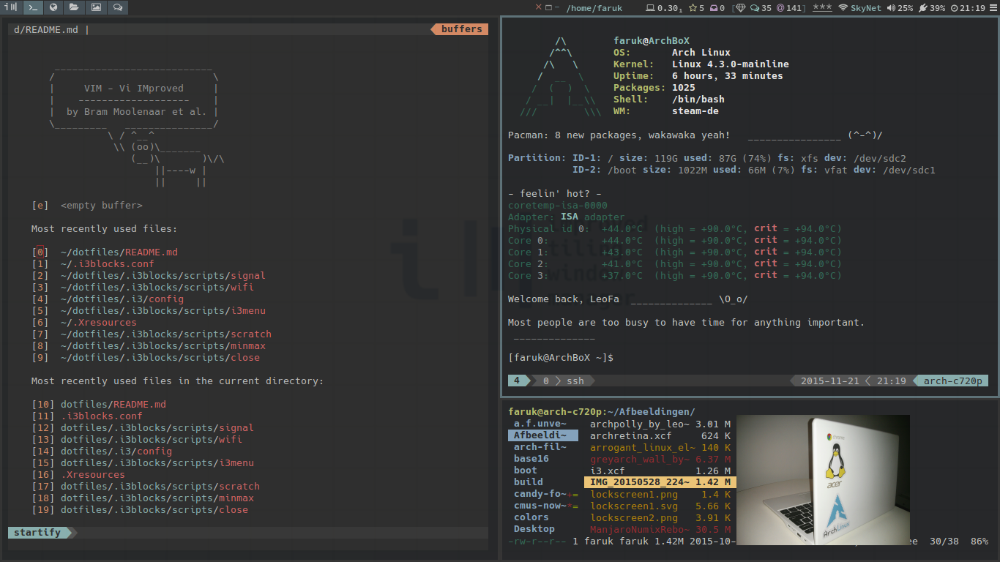

# leofa's dotfiles
my personal config files for a minimal desktop on my acer c720p chromebook running Arch Linux with the i3 window manager.

# some nice programs
i3gaps-next-git
i3blocks
termite
vim
rofi-git
j4-dmenu-desktop-git
menutray
compton
yad
etc.

# setup
see setup notes: <a href="https://github.com/leofa/dotfiles/blob/master/archinstall.txt">archinstall.txt</a> & <a href="https://github.com/leofa/dotfiles/blob/master/postinstall.txt">postinstall.txt </a>.

# latest screenshots
clean desktop

dirty
 
vim+tmux+ranger

new wallpaper by me :P 

colors based on <a href="https://github.com/chriskempson/tomorrow-theme">Tomorrow Night</a> theme by Chris Kempson

# WIP
keep on learning, ever changing..
 
