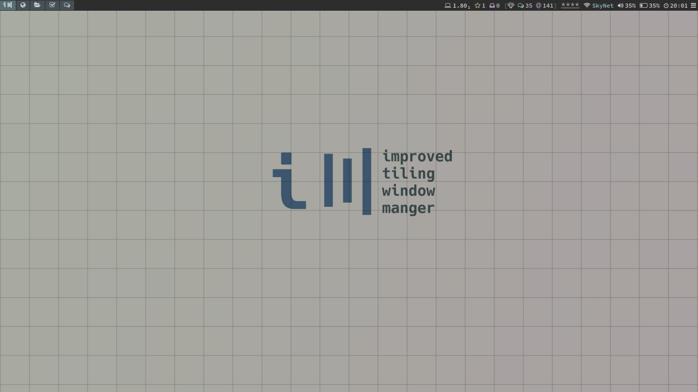
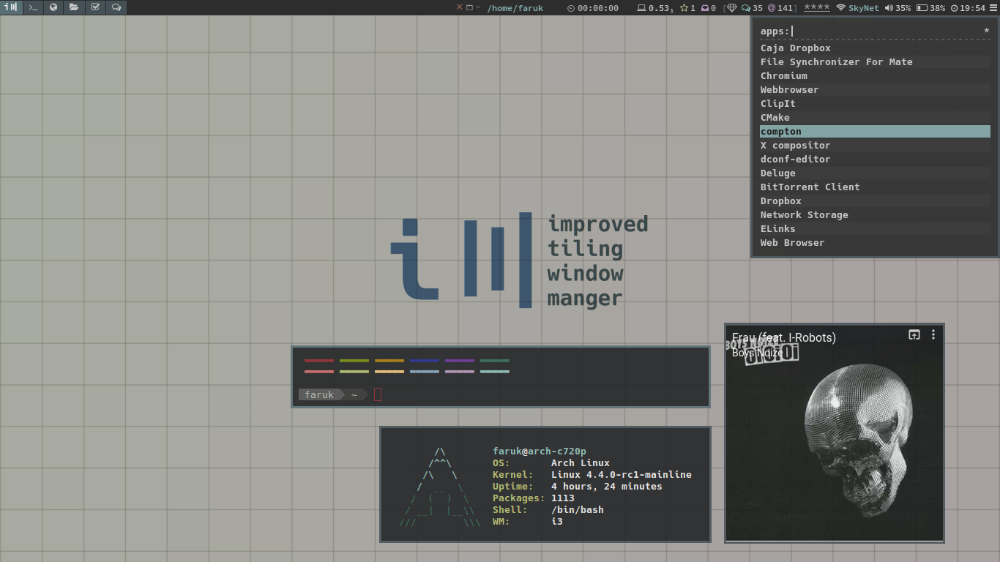
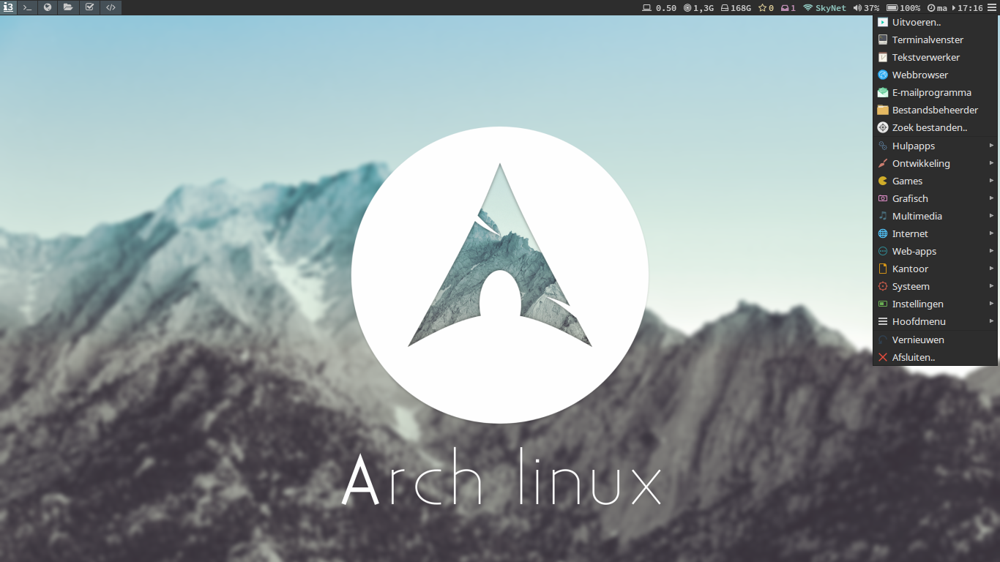
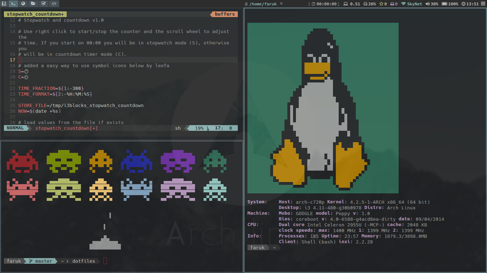

# leofa's dotfiles
my personal config files for a minimal desktop on my acer c720p chromebook running Arch Linux with the i3 window manager.

# some nice programs
i3gaps-next-git
i3blocks
termite
vim
rofi-git
j4-dmenu-desktop-git
menutray
compton
yad
etc.

# latest screenshots
clean

dirty
 
menutray

vim + colortheme
 

latest wallpaper by <a href="http://deadmetaler.deviantart.com/art/ArchOS-559048877">DeadMetaler</a>, colors mostly based on <a href="https://github.com/chriskempson/tomorrow-theme">Tomorrow Night</a> by Chris Kempson

# WIP
keep on learning, ever changing..
